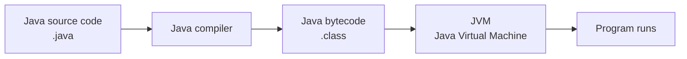

# Introduction to Java programming

## Programming languages

- A programming language is a way for humans to give instructions to a computer. It allows us to implement anything from simple automations to complex applications
- The programming language specific code is translated into machine-readable instructions by compilers or interpreters
- Different languages are designed for different goals and environments. They also share similarities, which makes learning new programming languages easier
- Based on the Stack Overflow Developer Survey 2025, JavaScript, Python and Java are among the most widely used programming languages

## Java programming language

- Java is an **object-oriented** programming language, meaning that programs consist of pieces called **classes**
- It is platform independent because Java code is compiled to bytecode, which runs on the **Java Virtual Machine (JVM)**
- Java is commonly used for large systems, backend services, and Android mobile applications
- Java is a strongly-typed language, meaning that each variable is defined with a fixed data type (e.g, `int` for integers and `String` for strings)

## Java for JavaScript programmers

- Java and JavaScript are different languages, even though their names are similar
- However, the languages have many similarities:
  - The basic control statements (conditional statements, loop statements etc.).
  - Most of the basic operators (e.g. arithmetic operators `+ - * /` and logical operators `&& ||`)
  - The basic punctuators (the use of several types brackets, semicolons etc.)
- The most major differences are:
  - Java is strongly-typed, each variable must have a fixed data type
  - Java program is based on the class structure
  - Java program is executed in the Java Virtual Machine, not in the web browser

## Java and JavaScript differences example

- Here is a similar program written in JavaScript and Java to highlight the similarities and differences of the two programming languages.

```js
function main() {
  let greetingText = "Hello!";

  for (let i = 1; i <= 5; i++) {
    console.log(i + " " + greetingText);
  }
}

main();
```

```java
// Class structure
public class HelloProgram {
    // Similar function-like structures, called methods
    public static void main(String[] args) {
        // Strongly-typed variables
        String greetingText = "Hello!";

        // Similar control statements
        for (int i = 1; i <= 5; i++) {
            // ⚠️ Semicolon ; is strictly required after statements!
            System.out.println(i + " " + greetingText);
        }
    }
}
```

## Anatomy of a Java program

- Java code is written in `.java` files, e.g. `HelloProgram.java`, which contains a class with the same 
- The `main` method is the entry point of the program, its contents will be executed while executing the program
- Statements are executed in order within the `main` method
- Curly braces `{}` define blocks of code
- A program may contain e.g. variables, control statements and methods

```java
// We define a class named HelloProgram
public class HelloProgram {
    // We define the main method as an entry point for the program
    public static void main(String[] args) {
        // Lines starting with "//" are comments, which aren't executed
        System.out.println("Hello world!");
    }
}
```

## Execution of a Java program

- The **Java compiler** converts the Java source code in the `.java` files into **bytecode**
- The bytecode is stored in `.class` files, which is ran on a program called **Java Virtual Machine (JVM)**
- The JVM is available on different operating systems, so the **same Java program can run on different platforms**



## Java Development environment

- Different code editors can be used to write Java Code. We will be using the **Visual Studio Code** editor
- On top writing the code, we need to a way to compile Java code to bytecode and run it on our operating system. This functionality is provided by the **Java Development Kit (JDK)**
- JDK contains **Java Runtime Environment (JRE)**, which contains the **JVM**, which the bytecode is ran on. It also contains the **Java compiler** and other development tools

## Hello world!

- In this example, the `main` method defines a string variable `message`, which is assigned with value `"Hello from Java!"` - The program prints the contents of the variable with the `System.out.println(message)` statement to the **console**
- In VS Code editor, the console window is below the code editing window. It contains everything related the program execution including printed messages, reading user input and error messages

```java
public class HelloProgram {
    public static void main(String[] args) {
        String message = "Hello from Java!";

        System.out.println(message);
    }
}
```

```text
Hello world!
```

## Variables

$$
\underbrace{\texttt{int}}_{\text{type}}
\quad
\underbrace{\texttt{age}}_{\text{name}}
\quad
\underbrace{\texttt{=}}_{\text{assignment}}
\quad
\underbrace{\texttt{33}}_{\text{value}}
$$

- Variables store values in memory, which can be accessed later
- Every variable has a **name** and a **data type**. The variable can only store values of the specified type
- Variables can change during program execution
- In this example, we define three variables `age`, `name` and `height`

```java
public class HelloProgram {
    public static void main(String[] args) {
        // int data type is for numbers without decimal part
        int age = 25;
        // String data types if for text. Text is wrapped around double quotes ""
        String name = "Alice";
        // double data types is for decimal numbers. ⚠️ "." is the decimal seperator, not ","!
        double height = 1.75;
        // Values can be joined into a single string using the + operator
        // Prints "Name: Alice, Age: 25, Height: 1.75"
        System.out.println("Name: " + name + ", Age: " + age + ", Height: " + height);
    }
}
```

## Assigning variables

```java
// Defining the variable favoriteFood with initial value "Pasta"
String favoriteFood = "Pasta";
// Reassign the value of the favoriteFood variable as "Pizza"
// ⚠️ Note that the variable type is only specified while defining it
favoriteFood = "Pizza";
// Prints "Pizza"
System.out.println(favoriteFood)

// It is possible to define a variable without the initial value
// ⚠️ But the variable can't be accessed before the value is assigned
double unknown;
unknown = 6.7;
// Prints "6.7"
System.out.println(unknown);
```

## Data types

| Data type | Description                                                  | Example                          |
| --------- | ------------------------------------------------------------ | -------------------------------- |
| `int`     | Stores whole numbers without a decimal part                  | `int age = 25;`                  |
| `long`    | Stores larger (`int` is limited to ~2 billion) whole numbers | `long population = 8000000000L;` |
| `double`  | Stores decimal numbers                                       | `double price = 19.99;`          |
| `boolean` | Stores either `true` or `false`                              | `boolean isReady = true;`        |
| `char`    | Stores a single character                                    | `char letter = 'A';`             |
| `String`  | Stores text                                                  | `String name = "Alice";`         |

## Scope of variables

- The scope of a variable is the part of the code where the variable can be referenced
- In general, a variable is accessible only within the block where it is declared and the blocks nested inside it
- Block is specified within `{ }` brackets, e.g. in a `if` statement

```java
int age = 18;

if (age >= 18) {
    // { } brackets specify a block, variables defined here won't be visible outside this block
    // ✅ age variable can be referenced here, because it is defined in the upper block
    String message = "You are " + age + "years old, you are an adult";
    System.out.println(message);
}

// ❌ message variable is out of scope, this will cause an error
System.out.println(message);
```

## Printing values

- `System.out.println()` prints a value **with a line break**
- `System.out.print()` prints a value **without a line break**
- `println` and `print` are called **methods**, which are similar to functions. Java has many built-in classes with useful methods, but we can also define methods of our own
- We can print e.g. text, numbers, and variables

```java
double weight = 82.5;
// println method will print "Number: 42" on its own line
System.out.println("Number: " + 42);
System.out.println(weight);
// print on the other hand won't add a line break, so these two messages will be on the same line
System.out.print("Hello");
System.out.print(" world");
```

```text
Number: 42
82.5
Hello world
```

## Reading user input

- Programs often ask the user for input which affects its execution
- For example, we ask for user's name and print a greeting message with the name
- We can use the built-in `Scanner` class's `nextLine` method to read values from the console

```java
// Scanner class is a built-in class, which we need to import to our program
import java.util.Scanner;

public class HelloProgram {
    public static void main(String[] args) {
        // Scanner is stored to the input variable
        Scanner input = new Scanner(System.in);
        System.out.print("Enter your name: ");
        // Read user input and store it to the name variable
        String name = input.nextLine();
        System.out.println("Hello " + name);
    }
}
```

```text
Enter your name: Kalle
Hello Kalle
```

## Calculations with arithmetic operators

- Java supports arithmetic operators for performing calculations:
  - `+` addition
  - `-` subtraction
  - `*` multiplication
  - `/` division
  - `%` remainder
- Calculations can be used with variables and literals (e.g. `1 + 2`)

```java
int a = 10;
int b = 3;

System.out.println(1 + 2); // 3
System.out.println(a + b); // 13
System.out.println(a - b); // 7
System.out.println(a * b); // 30
System.out.println(a / b); // 3
System.out.println(a % b); // 1
```

## Calculation behavior on different data types

```java
int a = 1
int b = 2
double c = 2

// ⚠️ Result is integer, the decimal part is cut off: 0.5 => 0
System.out.println(a / b); // 0
// Result is double, the decimal part is maintained
System.out.print(a / c); // 0.5
// ⚠️ If one of the variables or values is a string with the + operator, the result is a string
System.out.print("1" + a) // "11"
```

- If both variables are in division are integers, the result of is a integer with the decimal part cut off (not rounded)
- If one of the variables in the division is a double, the result is a double

## Decimals numbers and rounding

- Decimal values are often stored using `double` data type
- Division can produce result with a decimal part, e.g. `10 / 3 = 3.3333`
- We can round the result to the desired decimal accurary using the `DecimalFormat` class

```java
// DecimalFormat class is a built-in class, which we need to import to our program
import java.text.DecimalFormat

public class HelloProgram {
    public static void main(String[] args) {
        // The number of zeros after the "." specifies how many decimals are displayed
        DecimalFormat oneDecimal = new DecimalFormat("0.0");
        DecimalFormat twoDecimals = new DecimalFormat("0.00");

        double salary = 4000.56
        double result = 10 / 3; // 3.3333

        System.out.println("salary is " + oneDecimal.format(salary)); // "Salary is 4000.6"
        System.out.println("10 / 3 = " + twoDecimals.format(result)); // "10 / 3 = 3.33"
    }
}
```

## Benefits of strongly-typed programming languages

- We want to avoid programming errors (bugs) causing problems while the user is using the program (runtime)
- Strongly-typed languages like Java allow **spotting common type-based programming errors during compilation**, before the program is executed
- Let's consider the following example **without variable types** with a small programming error causing totally wrong behavior

```java
input = new Scanner(System.in);
annualBonus = 500;
System.out.print("Enter your salary: ");
salary = input.nextLine();
// ⚠️ Oops, nextLine method returns the user input as a string
// If salary is "4000", totalSalary becomes a string "4000" + 500 = "4000500"
totalSalary = salary + annualBonus;
```
