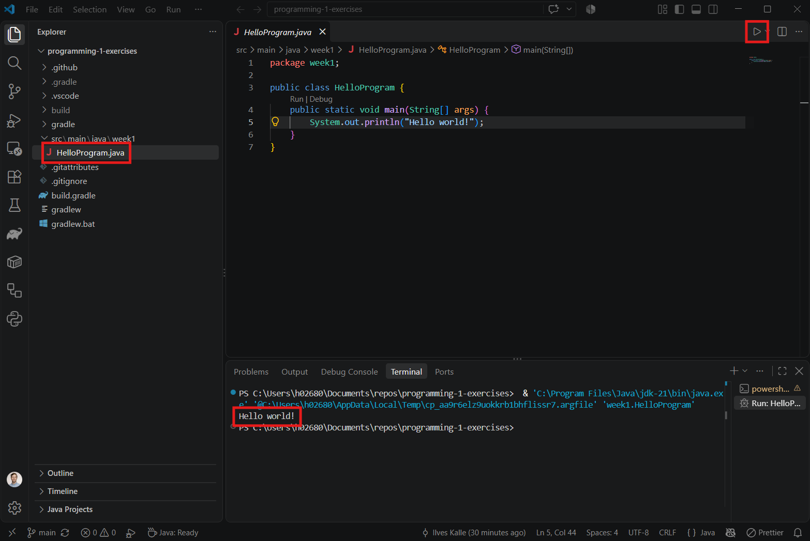

# Setting up the Java development environment

In order to write and execute Java code, you'll need the Java Development Kit (JDK) and a code editor. During this course we will be using the [Visual Studio Code](https://code.visualstudio.com/) editor. Visual Studio Code offers excellent tools for writing Java code, executing it and fixing programming errors by debugging.

Do the following to setup your Java development environment for the programming exercises:

1. If you haven't installed Visual Studio Code on your computer, start by [installing it](https://code.visualstudio.com/download).
2. On top the VS Code, you'll need the Java programming specific extensions called Java Extension Pack and the JDK. VS Code provides the Coding Pack for Java that includes both of these. Follow the [Coding Pack for Java instructions](https://code.visualstudio.com/docs/java/java-tutorial) to install it.
3. Download the [template Java project](https://github.com/hh-programming-1/programming-1-exercises) for the course's programming exercises. Click the green "Code" button and click "Download ZIP" from the dropdown menu. Extract the ZIP folder on your computer. Move the extracted folder to a convenient location where you want to store your course exercises.
4. Open VS Code and choose "File" > "Open Folder". Choose the template Java project folder to open it.
5. All the relevant content of the template project is in the `src/main/java` folder. In that folder, there's a `week1` folder with a `HelloProgram.java` file. Similarly as in the screenshot below, click the `HelloProgram.java` in the file tree to open the file, then click the ▶ icon on the top-right corner to run the main method. Finally, see the output in the console window below the editor window.

```
src/
└── main/
    └── java/
        └── week1/
            └── HelloProgram.java 👈
```

